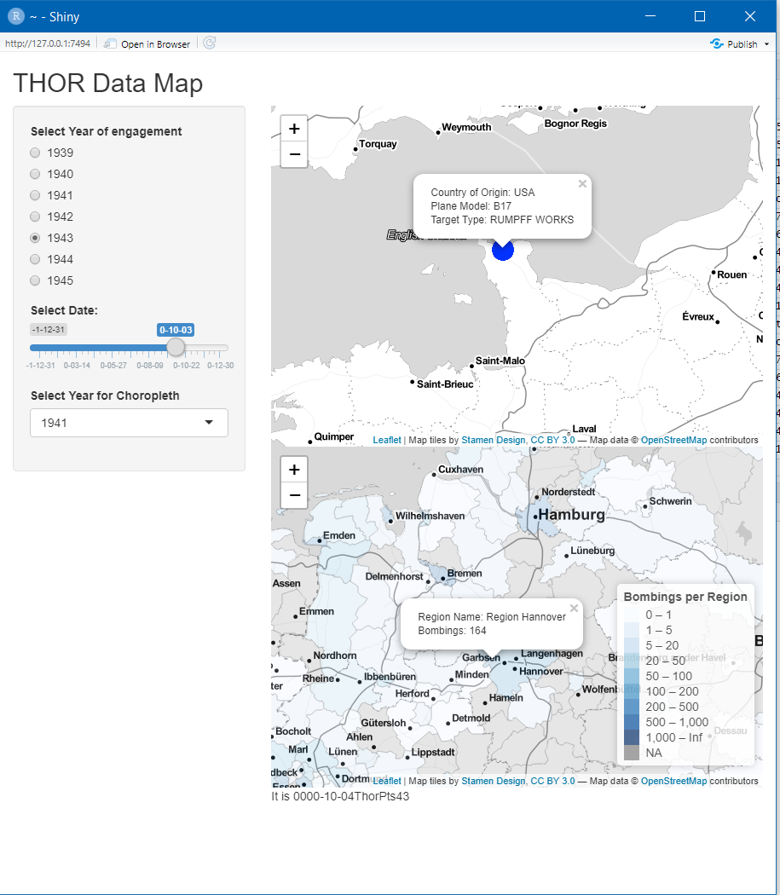
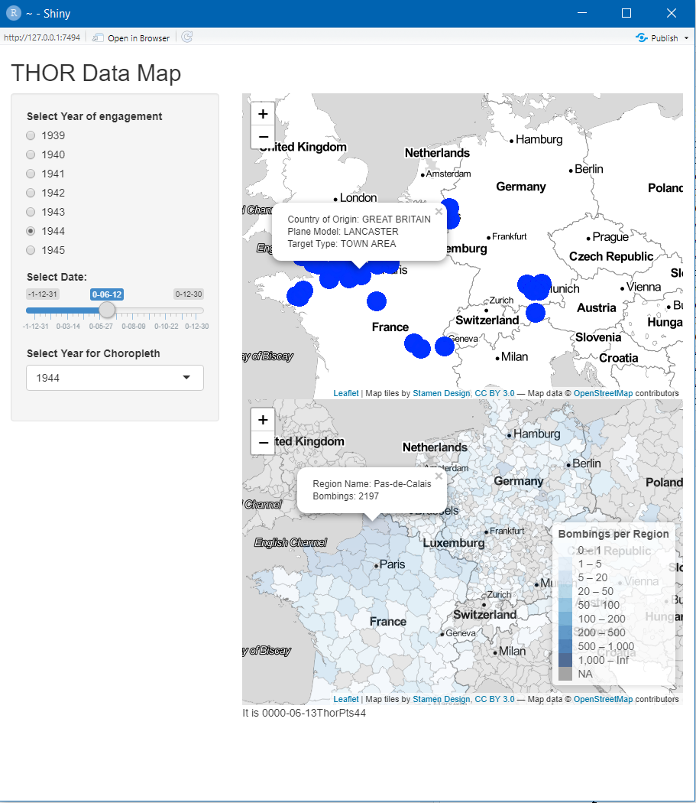
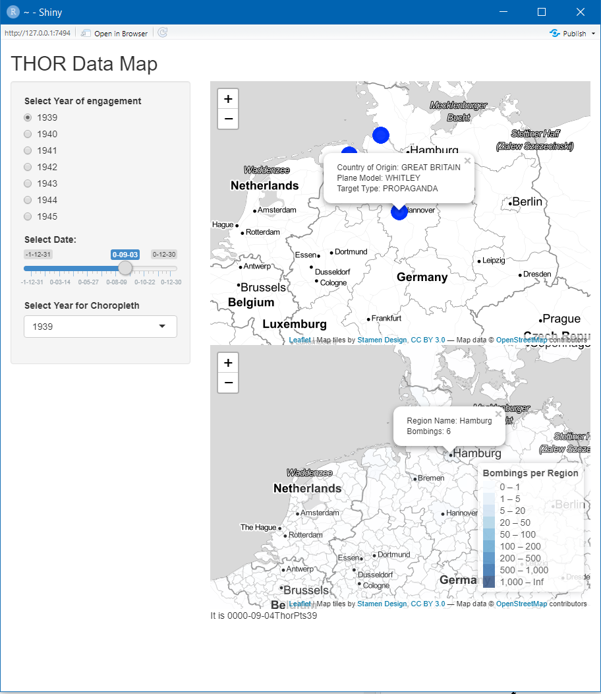

```{r setup, include=FALSE}
knitr::opts_chunk$set(echo = TRUE)
```
# Introduction and Objectives
My name is Joshua Neudorf, I am a student at the University of Chicago majoring in Geographical Sciences and Economics.

This Readme is intended to provide context, details, and instructions to replicating and understanding the R Shinyapp contained both within the attached packages on GitHub, and hopefully published to the link below. 

https://joshua-neudorf.shinyapps.io/THORWWII/

At the time of this writing, there is a recent bug within R Studio that is preventing me from publishing (https://stackoverflow.com/questions/62097231/upgrade-geos-version-on-shiny-apps-io/62165224). Hopefully this link will work when you click it as R Studio is updated or I figure it out. 

That said, here's an overview of the project. 

  In 2012, the United States Department of Defense first publicly revealed a multiyear project to index and digitize operational records kept from WWI to the present. This was dubbed THOR, or, Theatre History of Operations reports. In short, this database categorizes every single bomb dropped by the United States of America and its allies up to 1991, after which the data is classified. For the purpose of this study I am focusing on the Second World War, specifically the Western Front from 1939-1945, which alone contains tens of thousands of Lat/Long marked incidents representing millions of tons of dropped ordinance. 
  
  The purpose of this study has been to take this .csv delineated documentation, and apply it spatially. To this extent, I have constructed a shinyapp that aggregates and depicts this data in two different ways. First, I've created point layers with attribute information about every bomb dropped. Second, I've created a choropleth model that depicts the regionality of aggregate bomb droppage on a per annum basis. Details and instructions for such are below. 
  
  This is an important endeavor. Spatial data from 80 years ago is something I haven't seen before in my limited GIS experience. The specificity, detail, and wealth of attributes and context this has makes it especially important. Framing it in this way and offering a clear and replicatable visualization brings this information to a new audience and hopefully brings this data to people who could use it. 
  
# Data Model

I used two different datasets in this project (both of which are included within the github package)

First, I used World War II THOR Data, a .csv published by the US Airforce containing digitized mission reports from over thousands of bombing missions over the course of the Second World War. This contains many attribute details on every mission, ranging from plane type to nation of origin to target. 

Second, I used publicly available NUTS3 Aggregated polygons from the European Union. These are a universal set of granular regions akin to a census block groups. 
Our Temporal Resolution for this study will be daily, our timeframe will be from 1939 to 1945.

Our Spatial Resolution will be NUTS3 aggregated polygons. 

Important Variables:

THOR:
 1. Date
 2. Country of Origin
 3. Target Type
 4. Aircraft Type
 5. Lat/Long
 
NUTS3:
 1. GEOM 
 2. Region Name
 
## Citations and Links

EuroGeographics. “NUTS 2016” [Shapefile]. 1:1 Million. “eurostat”. 14/03/2019. https://ec.europa.eu/eurostat/web/gisco/geodata/reference-data/administrative-units-statistical-units/nuts

Datamil,  World War II THOR Data, V1 (November 22, 2016), distributed by data.world, https://data.world/datamil/world-war-ii-thor-data 


# Code As Markdown

Below is the code seen in the Github repository in markdown form with annotations.


First, loaded packages. Not all of these are entirely necessary, but there are enough dependencies within that I'd rather not risk breaking anything and know that this works. 
```{r}
library(shiny)
library(sf)
library(dplyr)
library(mlr)
library(ggplot2)
library(rgdal)
library(readr)
library(broom)
library(RColorBrewer)
library(ggmap)
library(tmap)
library(rgdal)
library(raster)
library(rjson)
library(jsonlite)
library(leaflet)
library(RCurl)
library(data.table)
library(lubridate)
library(GISTools)
library(tmap)
```
Reading Data: This is on my Machine, so set directory to wherever you've downloaded the dataset.
```{r}
THOR_Data <- fread("C:/Users/Finnmcoolr/Documents/THOR WWII/THOR_WWII_DATA_CLEAN.csv")

NUTS_Geog <- st_read("C:/Users/Finnmcoolr/Documents/THOR WWII/NUTS_RG_01M_2016_4326_LEVL_3.shp/NUTS_RG_01M_2016_4326_LEVL_3.shp")
```

Initial Plot to make sure everything works.

```{r}
plot(NUTS_Geog["LEVL_CODE"])
```

Clean Data to eliminate variables without proper geocoding

```{r}
THOR.y <-THOR_Data[!(is.na(THOR_Data$LATITUDE) | THOR_Data$LATITUDE==""), ]
THOR.z <-THOR.y[!(is.na(THOR.y$LONGITUDE) | THOR.y$LONGITUDE==""), ]
```

Subset our Data to pull only European for matching to our NUTS Shapefile (Note that the entire process would work the same for Pacific or North African Theaters, the "ETO" would simply be changed)
```{r}
ThorDataEurope <- THOR.z[(THOR.z$THEATER =="ETO"),]
```
Set our Raw Coordinates to sf Geometry
```{r}
ThorPoints <- st_as_sf(ThorDataEurope, crs = 4326, coords = c("LONGITUDE","LATITUDE"))
```
Reproject just to be sure (for my purposes, both sets were in WGS84)
``` {r}
ThorReproj <- st_transform(ThorPoints, crs(NUTS_Geog))
```
Format our Date (to make for easier subsetting)
```{r}
ThorPoints$MSNDATE <- as.Date(ThorPoints$MSNDATE , format = "%m/%d/%Y")
```
Order our Date for the same Purpose
``` {r}
ThorPoints[order(ThorPoints$MSNDATE ),]
```

Filter out Non-European French States in South America and the Pacific  
```{r}
NUTS_Geog <- subset(NUTS_Geog,NUTS_Geog$NUTS_ID != "FRY30")
NUTS_Geog <- subset(NUTS_Geog,NUTS_Geog$NUTS_ID != "FRY20")
NUTS_Geog <- subset(NUTS_Geog,NUTS_Geog$NUTS_ID != "FRY10")
NUTS_Geog <- subset(NUTS_Geog,NUTS_Geog$NUTS_ID != "FRY40")
NUTS_Geog <- subset(NUTS_Geog,NUTS_Geog$NUTS_ID != "FRY50")
```

Subset our Points Dataset by Year for ease of computation
```{r}
ThorPts39 <- subset(ThorPoints, MSNDATE >= "1939-01-01" & MSNDATE <= "1939-12-31")
year(ThorPts39$MSNDATE) <-0
```

Perform a Left Spatial Join to Create a New Polygon Layer with Counts for Yearly Bombings   
```{r}
wth39 <- st_join(ThorPts39, NUTS_Geog, join = st_within)
count39 <- count(as_tibble(wth39), NUTS_ID) %>% rename("ThorPts"= n)
NUTS_Geog39 <- left_join(NUTS_Geog, count39)
```
Repeat For Every Year
```{r}
ThorPts40 <- subset(ThorPoints, MSNDATE >= "1940-01-01" & MSNDATE <= "1940-12-31")
year(ThorPts40$MSNDATE) <-0
wth40 <- st_join(ThorPts40, NUTS_Geog, join = st_within)
count40 <- count(as_tibble(wth40), NUTS_ID) %>% rename("ThorPts"= n)
NUTS_Geog40 <- left_join(NUTS_Geog, count40)

ThorPts41 <- subset(ThorPoints, MSNDATE >= "1941-01-01" & MSNDATE <= "1941-12-31")
year(ThorPts41$MSNDATE) <-0
wth41 <- st_join(ThorPts41, NUTS_Geog, join = st_within)
count41 <- count(as_tibble(wth41), NUTS_ID) %>% rename("ThorPts"= n)
NUTS_Geog41 <- left_join(NUTS_Geog, count41)

ThorPts42 <- subset(ThorPoints, MSNDATE >= "1942-01-01" & MSNDATE <= "1942-12-31")
year(ThorPts42$MSNDATE) <-0
wth42 <- st_join(ThorPts42, NUTS_Geog, join = st_within)
count42 <- count(as_tibble(wth42), NUTS_ID) %>% rename("ThorPts"= n)
NUTS_Geog42 <- left_join(NUTS_Geog, count42)


ThorPts43 <- subset(ThorPoints, MSNDATE >= "1943-01-01" & MSNDATE <= "1943-12-31")
year(ThorPts43$MSNDATE) <-0
wth43 <- st_join(ThorPts43, NUTS_Geog, join = st_within)
count43 <- count(as_tibble(wth43), NUTS_ID) %>% rename("ThorPts"= n)
NUTS_Geog43 <- left_join(NUTS_Geog, count43)


ThorPts44 <- subset(ThorPoints, MSNDATE >= "1944-01-01" & MSNDATE <= "1944-12-31")
year(ThorPts44$MSNDATE) <-0
wth44 <- st_join(ThorPts44, NUTS_Geog, join = st_within)
count44 <- count(as_tibble(wth44), NUTS_ID) %>% rename("ThorPts"= n)
NUTS_Geog44 <- left_join(NUTS_Geog, count44)


ThorPts45 <- subset(ThorPoints, MSNDATE >= "1945-01-01" & MSNDATE <= "1945-12-31")
year(ThorPts45$MSNDATE) <-0
wth45 <- st_join(ThorPts45, NUTS_Geog, join = st_within)
count45 <- count(as_tibble(wth45), NUTS_ID) %>% rename("ThorPts"= n)
NUTS_Geog45 <- left_join(NUTS_Geog, count45)
```

Replace NA values with 0
```{r}
NUTS_Geog39[is.na(NUTS_Geog39)] = 0
NUTS_Geog40[is.na(NUTS_Geog39)] = 0
NUTS_Geog41[is.na(NUTS_Geog39)] = 0
NUTS_Geog42[is.na(NUTS_Geog39)] = 0
NUTS_Geog43[is.na(NUTS_Geog39)] = 0
NUTS_Geog44[is.na(NUTS_Geog39)] = 0
NUTS_Geog45[is.na(NUTS_Geog39)] = 0
```

Double Check everything didn't explode
```{r}
st_is_valid(NUTS_Geog)
```

## Begin our Shinyapp!

Start with UI Values
```{r}
ui <- fluidPage(
  ##Title Creation
  titlePanel("THOR Data Map"),
  sidebarLayout(
    sidebarPanel(
      ##Buttons to Select Year for Point Map
      radioButtons("year", "Select Year of engagement", c("1939" = "ThorPts39","1940" = "ThorPts40","1941" = "ThorPts41","1942" = "ThorPts42","1943" = "ThorPts43","1944" = "ThorPts44", "1945" = "ThorPts45"),),
      ##Temporal Slider to Select Date for Point Map
      sliderInput("date", "Select Date:",
                  min = as.Date("0000-01-01","%Y-%m-%d"),
                  max = as.Date("0000-12-31","%Y-%m-%d"),
                  value=as.Date("0000-09-27"),
                  timeFormat= "%Y-%m-%d"),
      ##Selection Box to Select Year for Polygon Choropleth
      selectInput("year2", "Select Year for Choropleth", c("1939" = "NUTS_Geog39","1940" = "NUTS_Geog40","1941" = "NUTS_Geog41","1942" = "NUTS_Geog42","1943" = "NUTS_Geog43","1944" = "NUTS_Geog44", "1945" = "NUTS_Geog45"))),
    mainPanel(
      ##Map Outputs
      leafletOutput("mymap"),
      leafletOutput("mymap2"),
      ))) 
```
Server Side Values
```{r}
server <- shinyServer(function(input, output){
  ##Set Reactive Input Values for our Years Inputs
  mapdata <- reactive({get(input$year)})
  mapdata2 <- reactive({get(input$year2)})
  ##Render First Point Map
  output$mymap <- renderLeaflet({
    mydata <- mapdata()
    leaflet()%>%
      ##Set Default View
      setView(15, 47.8, 4)%>%
      ##Load Basemap
      addProviderTiles(providers$Stamen.TonerLite,
                       options = providerTileOptions(noWrap = TRUE)
      ) %>%
      ##Set Point Parameters
      addCircleMarkers(data = mydata[mydata$MSNDATE == input$date,],
                       ##Set Popup Labels With Attribute Values
                       popup = paste(paste(paste("Country of Origin",mydata$COUNTRY_FLYING_MISSION, sep = ": " ), paste("Plane Model", mydata$AIRCRAFT_NAME, sep = ": "), sep = "<br>"),paste("Target Type", mydata$TGT_TYP, sep = ": "),sep = "<br>")
                       )
  })
  ##Render Second Choropleth Map
  output$mymap2 <- renderLeaflet({
    
    mydata2 <-mapdata2()
    ##Set Palette for Colors
    pal <- colorBin("Blues", domain = mydata2$ThorPts, bins = c(0,1,5, 20, 50, 100,200,500,1000, Inf))
    leaflet(mydata2) %>%
      ##Load Basemap
      addProviderTiles(providers$Stamen.TonerLite,
                       options = providerTileOptions(noWrap = TRUE)
      ) %>%
      ##Set Polygon Parameters
      addPolygons(
        fillColor = ~pal(ThorPts),
        weight = .5,
        opacity = .5,
        color = "grey",
        highlight = highlightOptions(
          weight = 3,
          color = "blue",
          bringToFront = TRUE
        ),
        ##Set Popup Attribute Labels
        popup = paste(paste("Region Name",mydata2$NUTS_NAME, sep = ": " ), paste("Bombings", mydata2$ThorPts, sep = ": "), sep = "<br>")
      ) %>%
      ##Add Legend
    addLegend(pal = pal, values = ~ThorPts, opacity = 0.7, title = "Bombings per Region",
              position = "bottomright")
    
  })
  
})
```

Run our Shinyapp!
```{r}
shinyApp(ui = ui, server = server)
```

If this weren't a static html, you would see something like this:








# Conclusions

  Overall, I found using leaflet and r Shiny to accomplish this very effective. With interactive popout values, fast and easy subsetting, and easily modified maps and charts, the features available allow me to do justice to the importance and history of this dataset, the thousands of soldiers 80 years ago who hand wrote every report for every point, and the USAF personnel who digitized every one. 

  That is not to say, however, that this project was perfect. There are many avenues of future study. 
  
  First, I was constrained by r studio's ability to handle large datasets quickly. This was part of my decision to exclusively focus on the European Theater. With software like Carto, I could expand this analysis globally. Handling the near 200,000 observations involved in this study rather than the 90,000 I used would double the scale of this analysis. 
  
  Second, the R Shinyapp can always be formatted better. I do not know how to use CSS or HTML to make things look good. If I learned as such, I could create a far more professional-looking dashboard with better UI and data visualization. This would be of benefit, especially if this were to be published. 
  
  Third, this data could be easily processed into a data package from the work I've done here alone. Expanding this worldwide would offer easy access to spatial bombing data for governments, first responders, social scientists, or anyone who might have interest in where the Allies dropped bombs in the 40s. This is a realistic and beneficial avenue for future study.
  
  Fourth, NUTS3 aggregation is a baseline layer for most European statistics by both national and supranational authorities. Spatial Data Analysis of this polygon data offers topics for potential future papers. Income, population, public health, and crime could all be analyzed with spatial consideration of a region's attention during WWII air raids. 
  
  
